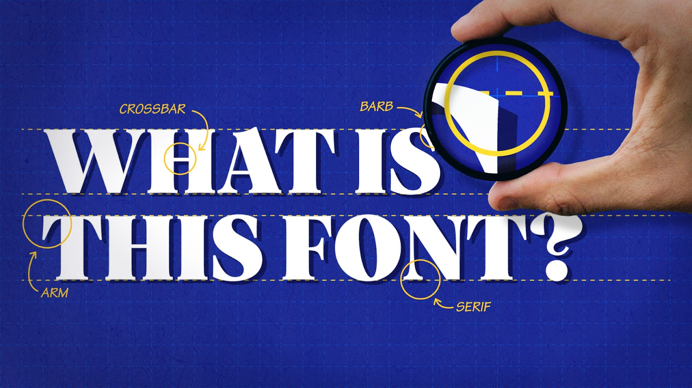

## Font type prediction


## About the project
Forgot which font you used in your old logo or design? Have you been inspired by one of your favorite designers and interested in finding fonts of a similar style? This model will help you to answer that agonizing question, “What font is this?”

TThis model is great font identification technology with amazing accuracy.

Note: This project was made for learning and fun purposes and is not a production service

## Data source
In this project, I used the data from the [Charater Font Images](https://www.kaggle.com/datasets/muhammadardiputra/font-recognition-data) dataset on Kaggle.

### Dataset description
This dataset contains information about different font styles. The basic thing that you can do with this dataset is to create a machine learning or deep learning model which is able to recognize different font styles. There are 48 different classes, where each of those consists of 5000 picture of texts. Keep in mind that the size of those images are varying. So you'll probably need to do a little bit of preprocessing towards their size. In addition, there are two versions of this dataset: first the one that is colored in grayscale (folder "Font Dataset Large), and second, the one that is colored in RGB (folder "Font Dataset Large Color").

# Project structure:
- [notebooks](notebooks) - Folder with notebooks
  - [EDA](<notebooks/EDA and data preparation.ipynb>) - Exploratory data analysis and data preparation
  - [Model selection](<notebooks/model training.ipynb>) - Model creation and selection
- [scripts](scripts) - Folder with scripts
  - [model training](scripts/model_training.py) - Script for model training
  - [model evaluation](scripts/model_evaluation.py) - Script for model evaluation
- [data](data) - Folder with data
  - [raw](data/raw) - Folder with raw data
  - [processed](data/processed) - Folder with processed data (created during data preparation)
- [artifacts](artefacts) - Folder with artifacts of the project (weights created during training)
- [docker](docker) - Folder with docker files
- [README.md](README.md) - Project description

# How to run the project:
1. Clone the repository
```bash
git clone https://github.com/danilson33/ml-zoomcamp-capstone-1-project.git
```
2. Run in project root
Build docker container:
```bash
docker build -t font_type_prediction -f docker/Dockerfile .
```
3. [Optional] Download the dataset.
You can download it manually from [here](https://www.kaggle.com/datasets/muhammadardiputra/font-recognition-data) and unzip to data/raw folder
Or you hcan download it from cli, using your kaggle account [Configuration](https://www.kaggle.com/discussions/general/156610)
```bash
kaggle datasets download -d muhammadardiputra/font-recognition-data
```
Make sure your data folder have next structure
```
.
├── raw
│   ├── Font Dataset Large
│   └── Font Dataset Large Color
```
4. Run docker container
```bash
docker run -it --name font_type_prediction -p 9696:9696 font_type_prediction   
```
5. [Optional] Model training (retrain)
```bash
 docker exec font_type_prediction python /app/scripts/model_training.py     
```
6. Prediction example
You can test API on [http://localhost:9696](http://localhost:9696)
or by curl:
```bash
curl -F "file=@data/processed/Arial/Image_48.jpg" http://localhost:9696/predict
```
Response:
```json
{"font_type":"Arial","status":"success"}
```